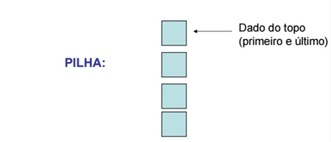
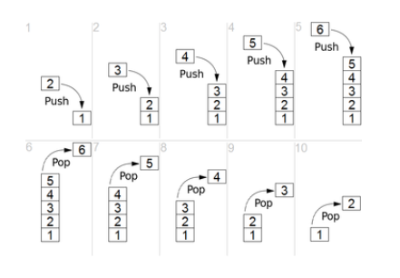
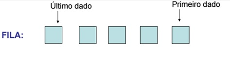
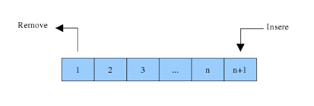

<div align="center" id="top"> 
      
</div>

<h1 align="center">Estrutura de Dados em Javascript</h1>

<p align="center">
  

  

  

  
  
</p>

<p align="center">
  <a href="#dart-about">About</a> &#xa0; | &#xa0; 
  <a href="#rocket-technologies">Technologies</a> &#xa0; | &#xa0;
  <a href="#white_check_mark-requirements">Requirements</a> &#xa0; | &#xa0;
  <a href="#checkered_flag-starting">Starting</a> &#xa0; | &#xa0;
  <a href="#memo-license">License</a> &#xa0; | &#xa0;
  <a href="https://github.com/wsasouza" target="_blank">Author</a>
</p>

<br>

## :dart: About

**Estruturas de Dados em Javascript**
Implementação das estruturas de dados mais conhecidas utilizando a linguagem Javascript.

## 1. Pilha (Stack)

<div align="left"> 
      
</div>

A pilha é uma estrutura de dados básica que fornece a lógica conhecida por LIFO(Last In, First out). Isso significa que o ultimo dado adicionado a estrutura será o primeiro removido dela e por isso foca a entrada e saída de dados na mesma ponta do vetor/lista.

<div align="left"> 
    
  <p><i>Passo a passo de um funcionamento de uma Pilha/Stack.</i></p>  
</div>

## 2. Fila (Queue)

<div align="left"> 
       
</div>

Fila é um tipo de estrutura de dados com um controle definido pela lógica FIFO (do inglês first in, last out). Esse controle quer dizer que os dados contidos nela são podem entrar apenas por uma ponta e deverão sair pela outra. Com isso, garante-se que o primeiro dado que entrou será o primeiro a sair da fila.

A fila é uma estrutura de dados muito útil quando se possui um serviço ao qual o sistema recebe alimentação de diversas fontes, mas precisa manter uma ordem do “primeiro que chegou será o primeiro servido”. Um exemplo simples é o sistema que administra diversos computadores ligados a uma única impressora.

<div align="left"> 
       
</div>

## :rocket: Technologies

The following tools were used in this project:

- [Javascript](https://www.javascript.com/)

## :white_check_mark: Requirements

Before starting :checkered_flag:, you need to have [Git](https://git-scm.com) and [Node](https://nodejs.org/en/) installed.

## :checkered_flag: Starting

```bash
# Clone this project
$ git clone https://github.com/wsasouza/data-structures-in-javascript

# Access
$ cd data-structures-in-javascript

# Run the project
$ node [selected file]

```

## :memo: License

This project is under license from MIT. For more details, see the [LICENSE](LICENSE.md) file.

Made with :heart: by <a href="https://github.com/wsasouza" target="_blank">Walter Santos de Andrade Souza</a>

&#xa0;

<a href="#top">Back to top</a>
